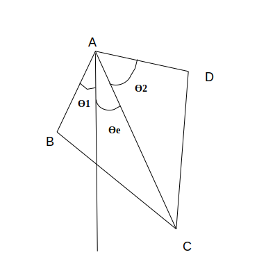

# Parallel Robotics

A Parallel Robot refers to a kinematic chain in which a fixed platform and moving platform are connected to each other by several Kinematic serial chains.

## Delta Robot

Delta Robot is a type of Parallel Robot consisting of 3 identical Kinematics chains connected to a Base, The key design feature of Delta Robots are the use of Parallelograms in the arms
which restrict the movement of the base/end plate to pure translation( i.e. Only movement in X,Y or Z direction) 
Delta Robots are known for it's high speed and high acceleration, Also having all the kinematic chains connected together to end-effector increases stiffness of the robot.

In this project we have Designed a 3-DOF Delta Robot

## kinematic Analysis

#### +  Forward Kinematics:
Forward kinematics refers to the use of the kinematic equations of a robot to compute the position of the end-effector from specified values for the joint parameters.

#### +  Inverse kinematics:
Inverse kinematics is the mathematical process of calculating the variable joint parameters needed to place the end of a kinematic chain, when the end-effector position is given

For the ease of understanding initially we develop a 2 DOF Delta parallel robot

1. Kinematics of 2-DOF Delta robot

    + Considering Frame and Base to be a point

    
    
    

