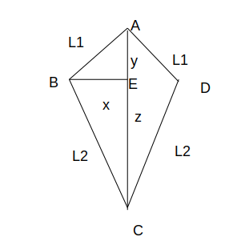

# Parallel Robotics

A Parallel Robot refers to a kinematic chain in which a fixed platform and moving platform are connected to each other by several serial Kinematic chains.

## Delta Robot

Delta Robot is a type of Parallel Robot consisting of 3 identical Kinematics chains connected to a Base, The key design feature of Delta Robots are the use of Parallelograms in the arms
which restrict the movement of the base/end plate to pure translation( i.e. Only movement in X,Y or Z direction) 
Delta Robots are known for it's high speed and high acceleration, Also having all the kinematic chains connected together to end-effector increases stiffness of the robot.

In this project we have Design a 3-DOF Delta Robot

## kinematic Analysis

+  Forward Kinematics: 
Forward kinematics refers to the use of the kinematic equations of a robot to compute the position of the end-effector from specified values for the joint parameters.

+  Inverse kinematics: 
Inverse kinematics is the mathematical process of calculating the variable joint parameters needed to place the end of a kinematic chain, when the end-effector position is given

For the ease of understanding initially we develop a 2 DOF Delta parallel robot

##  1. Kinematics of 2-DOF Delta robot

+ Considering Frame and Base to be a point

Initially considering the 2-axis delta robot with frame and base length to be zero,let AB and AD be the upper links say L1, BC and DC 
be the lower links say L2. According to the standard design of a delta robot we assume the length of links L1 and L2 to be in the ratio 
of 1:2,hence L2 = 2(L1). We calculate the distance between the frame and base points using the basic trigonometric equations and 
the concept of pythagoras theorem.

   Case 1: Both  and  are equal

   

   From Δ ABC,

   
     
                                            -----------(eqn-1)
   
   From ΔBCE,	 	 	 	
   
   	 	 	
   
   
   
   -------------(eqn-2)
  
   From eqn-1 and eqn-2,
   
  
   
   
   
   Hence,the end-effector C(x,y) = C(0,AC)

    
    

    

